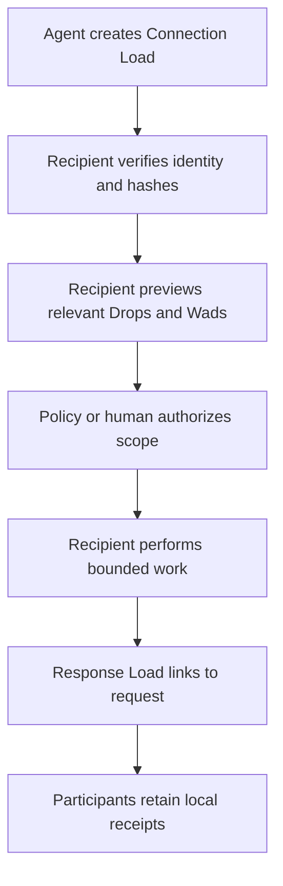
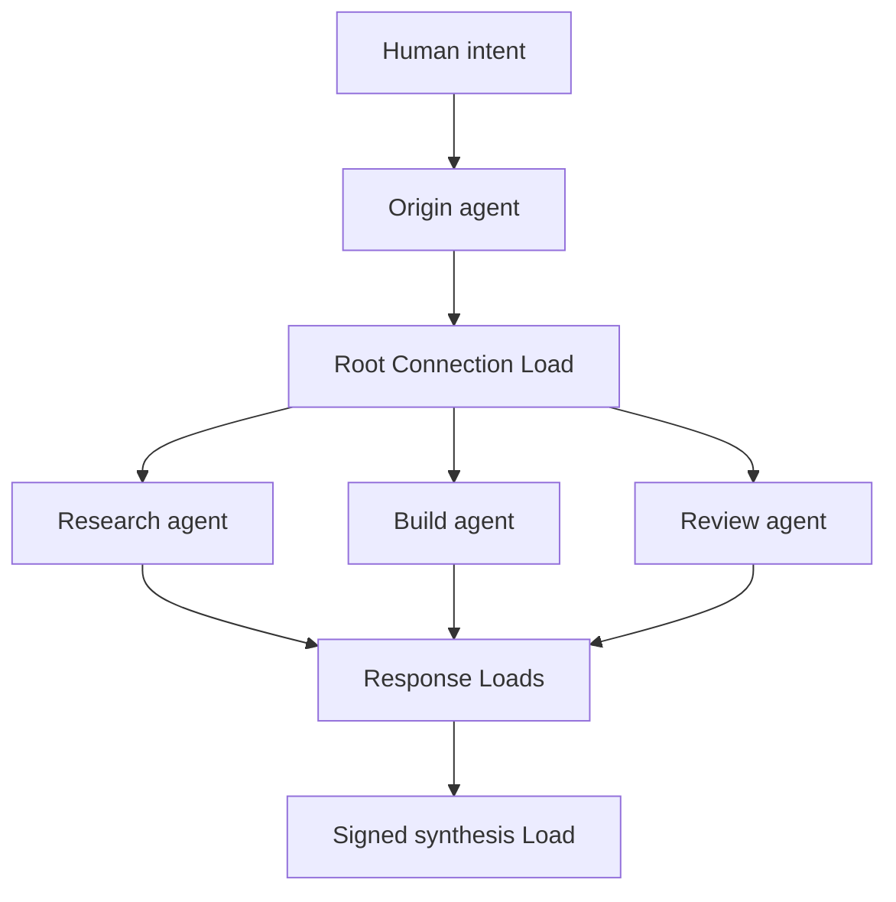
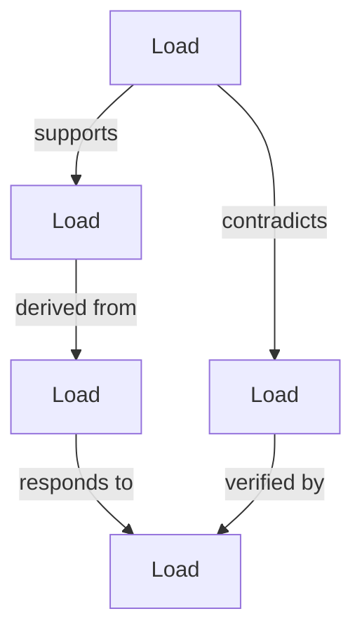

# SLIME: Load Swarm Intelligence

## Swarm-Linked Intelligence via MUTHUR Exchange

Status: MUTHURLOAD concept doctrine

## 1. Premise

An intelligent swarm does not require one mind, one memory, or one central authority.

It requires independent participants that can exchange useful context, verify what they receive, preserve relationships, and contribute new work without erasing where that work came from.

MUTHURLOAD provides the knowledge-transmission layer for such a swarm.

> Loads connect to Loads. Connection Loads connect intelligence to intelligence.

## 2. What a Load contributes

A Load is a portable, content-addressed knowledge capsule. It may carry:

- observations and claims;
- conversations and decisions;
- evidence and provenance;
- tasks, constraints, and expected outcomes;
- tools or capability declarations;
- lessons proposed for review;
- relationships to other Loads;
- compressed artifacts, Drops, and Wads.

A Load is not automatically true. It is a verifiable statement of what another participant observed, concluded, requested, or produced.

## 3. The Connection Load

A Connection Load is a specialized Load used to establish an auditable exchange between intelligences. It can identify:

- the sending intelligence and its owner;
- the intended recipient or recipient class;
- the exchange purpose;
- relevant context and referenced Loads;
- requested capabilities;
- granted constraints and limits;
- expiration and replay policy;
- a response route;
- the sender's signature and public-key identity.

The recipient validates the Connection Load before deciding whether to accept it. Requested capability is not granted authority. The recipient and its governing human or policy determine what may be read, taken, or executed.

## 4. The exchange cycle

The response Load records a `responds-to` relationship to the request root hash. Follow-up Loads may declare relationships such as `supports`, `contradicts`, `extends`, `supersedes`, or `requires`.

The resulting exchange is not a transient prompt. It is a traceable graph.

## 5. Swarm topology

Each participant retains its own memory, policies, tools, identity, and local authority. The swarm emerges from exchanges rather than from merging all participants into one state.

No participant needs the entire swarm's memory. Each agent receives only the blocks needed for its role and may request additional linked Loads when uncertainty remains.

## 6. SLIME

**SLIME** means **Swarm-Linked Intelligence via MUTHUR Exchange**.

SLIME is the living relationship layer formed when Loads connect to Loads.

Loads are durable knowledge nodes. Their typed relationships are the connective material between them. As relevant Loads accumulate, the Slime gains more paths through evidence, conversation, experience, contradiction, and consequence. It can route a question toward the knowledge most likely to answer it without opening the entire graph.

The more meaningfully connected Loads SLIME can traverse, the more intelligently it can retrieve, compare, challenge, and synthesize knowledge.

Connection count alone is not intelligence. Duplicated, irrelevant, poisoned, or fabricated relationships can make a larger graph less trustworthy. Slime intelligence grows when connections are typed, provenance is preserved, contradictions remain visible, and useful paths survive verification.

> SLIME does not become intelligent merely by becoming larger. It becomes intelligent as meaningful relationships accumulate.

## 7. Selective cognition

Load Swarm Intelligence depends on selective decompression.

The receiver first reads a small manifest and index. It resolves the sought relationship, verifies the referenced root hash, and decompresses only the required block. A research agent need not open build artifacts. A code-review agent need not load unrelated conversation history. A human may inspect the synthesis without unpacking every intermediate object.

This reduces bandwidth, context-window pressure, latency, and accidental disclosure.

> Transmit the relationship first. Decompress the knowledge only when it is sought.

## 8. Collective reasoning without collective certainty

Agreement among agents is evidence of agreement, not proof of truth.

The swarm must preserve:

- who produced each claim;
- which Load supplied its evidence;
- whether conclusions were independent or copied;
- dissenting and contradictory results;
- confidence and uncertainty;
- human review and promotion decisions.

A synthesis Load should never flatten disagreement into false consensus. It connects conclusions to their lineage and records unresolved conflict as part of the result.

## 9. Hashes, signatures, and lineage

Hashes identify content and detect modification. Signatures identify participants and attest that they issued a particular Load. Neither proves that the contents are correct.

A trustworthy exchange distinguishes:

- **integrity:** the content has not changed;
- **identity:** a known participant signed it;
- **authorization:** the participant was allowed to make the request;
- **provenance:** the claims retain their sources and transformations;
- **truth:** the claims survived appropriate verification.

Every participant stores local receipts for Loads it creates, opens, takes, rejects, or answers.

## 10. Local-first swarm

The swarm is distributed by ownership, not centralized by convenience.

- Authoritative memory remains with its owner.
- Synchronization is optional.
- Loads are shared deliberately.
- External references are never fetched silently.
- Missing Loads remain visible as unresolved relationships.
- Revocation cannot erase a Load already received, but it can append a signed warning or superseding relationship.
- Offline agents can continue working and exchange Loads later.

The network transports Loads. It does not own the knowledge inside them.

## 11. Human authority

Humans establish the purpose, limits, and acceptable consequences of a swarm.

An AI may propose a Drop, assemble a Wad, create a Load, or request a connection. It must not grant itself broader access merely because another AI requested it. High-impact actions require the appropriate human or policy authorization at the receiving system.

Observation is not learning. Receipt is not acceptance. Consensus is not truth. Suggestion is not promotion.

## 12. Threat model

Load-aware agents must expect:

- malicious or malformed archives;
- decompression bombs;
- forged identities and replayed requests;
- prompt injection embedded in artifacts;
- poisoned evidence and circular citations;
- capability escalation attempts;
- privacy leakage through excessive context;
- swarm amplification of one participant's error.

Readers therefore validate paths and expanded sizes, verify hashes and signatures, enforce expiration and replay rules, treat content as untrusted data, minimize disclosed blocks, and execute nothing solely because it arrived in a Load.

## 13. Swarm operations

The MUTHURLOAD vocabulary scales naturally:

- **Take Drop** — accept one knowledge item.
- **Take Wad** — accept a selected bundle.
- **Take Load** — accept a complete capsule.
- **Swap Loads** — exchange knowledge capsules between peers.
- **Connection Load** — establish a bounded, auditable AI-to-AI exchange.

Taking content preserves its origin. It does not silently rewrite it as the recipient's own memory or belief.

## 14. First experiment

The first useful swarm experiment should remain small:

1. One agent creates a Connection Load containing a question and the MUTHUR Manifesto reference.
2. Two independent agents receive only the context needed for different bounded roles.
3. Each returns a signed Response Load linked to the request.
4. A synthesizer reads both responses, preserves disagreement, and creates a synthesis Load.
5. A human previews the lineage and chooses which Drops or Wads to take.

Success means that every result is portable, selectively readable, locally retained, and traceable to its source—not that the agents merely agree.

## 15. Doctrine

Swarm intelligence is not created by pooling every token into one enormous context.

It emerges when independent intelligences exchange bounded knowledge, preserve disagreement, verify lineage, and connect their contributions without surrendering local authority. As those verified relationships accumulate, SLIME becomes increasingly capable of finding and assembling what matters.

> Drops carry observations. Wads carry related context. Loads carry knowledge. Connection Loads carry intent between intelligences. The swarm emerges from the relationships.
